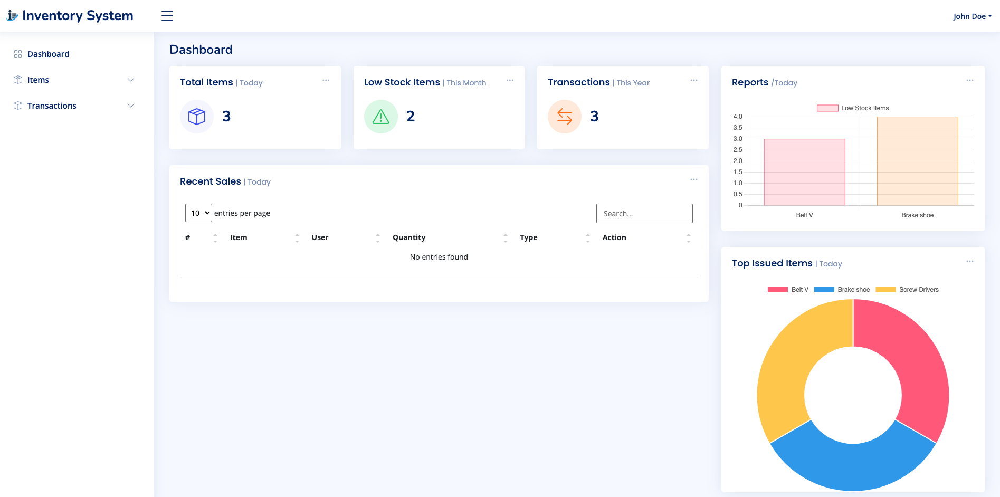
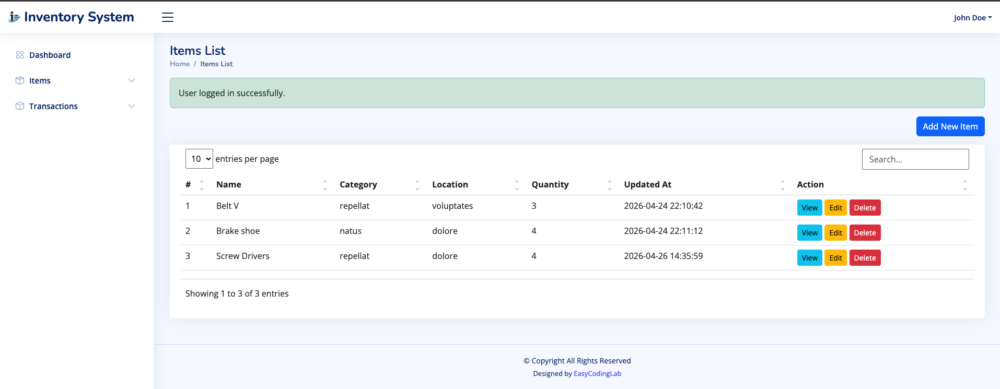
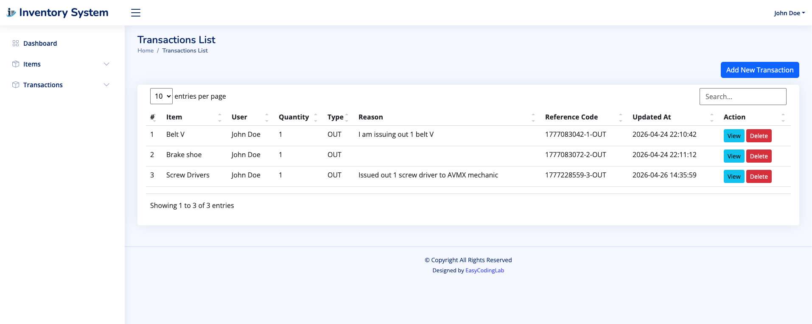
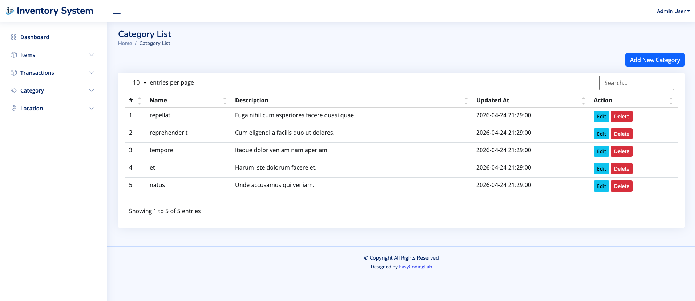
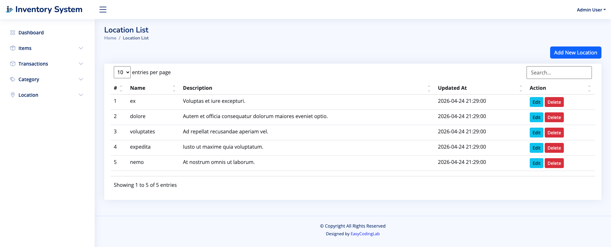
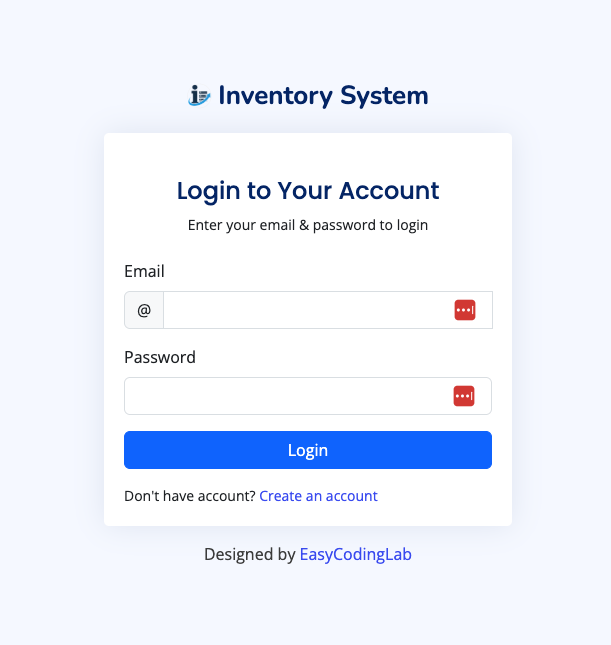

# Inventory Management System

A full-stack web application built with **Laravel 13** for managing inventory, stock movements, and reporting. Designed for small-to-medium businesses that need clear visibility into their stock levels, item transactions, and warehouse locations.

---

## Screenshots

<table>
  <tr>
    <td align="center"><b>Dashboard</b></td>
    <td align="center"><b>Items List</b></td>
  </tr>
  <tr>
    <td></td>
    <td></td>
  </tr>
  <tr>
    <td align="center"><b>Transactions</b></td>
    <td align="center"><b>Category List</b></td>
  </tr>
  <tr>
    <td></td>
    <td></td>
  </tr>
  <tr>
    <td align="center"><b>Location List</b></td>
    <td align="center"><b>Login</b></td>
  </tr>
  <tr>
    <td></td>
    <td></td>
  </tr>
</table>

---

## Features

### Role-Based Access Control
- Two roles: **Admin** and **User**
- Admins have full access including Category and Location management
- Users can manage Items and Transactions only
- Middleware-protected routes enforce permissions at the server level

### Dashboard
- At-a-glance stats: total items, low-stock count, and transaction volume
- **Bar chart** highlighting items at or below their minimum stock level
- **Doughnut chart** showing the top issued items by quantity
- Recent transactions table with live search and pagination

### Items
- Full CRUD (Create, Read, Update, Delete)
- Fields: name, description, SKU (unique), quantity, minimum stock level, category, location
- Automatic low-stock detection based on configurable `min_stock_level`

### Transactions
- Record stock movements as **IN**, **OUT**, or **ADJUSTMENT**
- Auto-generated reference codes (timestamp + item ID + type)
- Stock guard: prevents OUT transactions when quantity is insufficient
- Each transaction is linked to the authenticated user

### Categories & Locations
- Admin-only CRUD for both resources
- Sortable, searchable tables powered by Simple DataTables
- Categories and locations are linked to items for organised filtering

### User Accounts
- Secure registration and login with bcrypt password hashing
- Profile management (update name)
- Password change with current-password verification
- Session-based authentication with CSRF protection

### Audit & Alerts
- `audit_logs` table records every action with old/new values and IP address
- `stock_alerts` table flags unresolved low-stock events with item-level messages

---

## Tech Stack

| Layer | Technology |
|-------|-----------|
| Backend | Laravel 13 (PHP 8.3) |
| Frontend | Bootstrap 5, Bootstrap Icons, Boxicons, Remix Icons |
| Charts | ApexCharts, Chart.js, ECharts |
| Tables | Simple DataTables |
| Database | MySQL |
| Build | Vite |
| Testing | PHPUnit 12 |

---

## Getting Started

### Prerequisites
- PHP 8.3+
- Composer
- Node.js & npm
- MySQL database or any database of your choice

### Installation

```bash
# 1. Clone the repository
git clone https://github.com/vaggor/inventory-system.git
cd inventory-system

# 2. Install PHP dependencies
composer install

# 3. Install JS dependencies and build assets
npm install
npm run build

# 4. Set up environment
cp .env.example .env
php artisan key:generate

# 5. Configure your database in .env
# DB_DATABASE=inventory_system
# DB_USERNAME=your_user
# DB_PASSWORD=your_password

# 6. Run migrations and seed demo data
php artisan migrate --seed
```

> Alternatively, run all setup steps at once:
> ```bash
> composer run setup
> ```

### Running Locally

```bash
composer run dev
```

This starts the Laravel dev server, Vite, queue listener, and log watcher concurrently.

Then open **http://localhost:8000** in your browser.

### Demo Credentials

| Role | Email | Password |
|------|-------|----------|
| Admin | admin@mail.com | 12345678 |
| User | jdoe@mail.com | 1234567 |

> Seeded by `database/seeders/DatabaseSeeder.php`. Update defaults there if needed.

---

## Project Structure

```
app/
├── Http/
│   ├── Controllers/        # DashboardController, ItemController,
│   │                       # TransactionController, CategoryController,
│   │                       # LocationController, UserController
│   └── Middleware/
│       └── AdminMiddleware.php   # Role gate for admin-only routes
├── Models/                 # Item, Transaction, Category, Location, User
database/
├── migrations/             # Full schema: users, items, transactions,
│                           # categories, locations, audit_logs, stock_alerts
├── factories/              # CategoryFactory, LocationFactory, UserFactory
└── seeders/
resources/views/            # Blade templates per module
routes/
└── web.php                 # Auth routes + resource routes + admin middleware group
```

---

## Database Schema

```
users           — id, name, email, password, role (admin|user)
items           — id, name, description, sku, quantity, min_stock_level, category_id, location_id
transactions    — id, item_id, user_id, type (IN|OUT|ADJUSTMENT), quantity, reason, reference_code
categories      — id, name, description
locations       — id, name, description
audit_logs      — id, user_id, action, table_name, record_id, old_value, new_value, ip_address
stock_alerts    — id, item_id, message, is_resolved
```

---

## Route Overview

```
GET  /                      → Login page
GET  /login  |  POST /login → Login form & authentication
POST /logout                → Log out
GET  /register  |  POST     → Registration

# Authenticated
GET  /dashboard             → Stats, charts, recent transactions
GET  /items                 → Item list
GET  /items/create          → Create item form
GET  /items/{id}            → Item detail
GET  /items/{id}/edit       → Edit item
GET  /transactions          → Transaction list
GET  /transactions/create   → Create transaction form
GET  /transactions/{id}     → Transaction detail
GET  /profile               → User profile & password change

# Admin only
GET  /categories            → Category management
GET  /locations             → Location management
```

---

## Running Tests

```bash
php artisan test
```